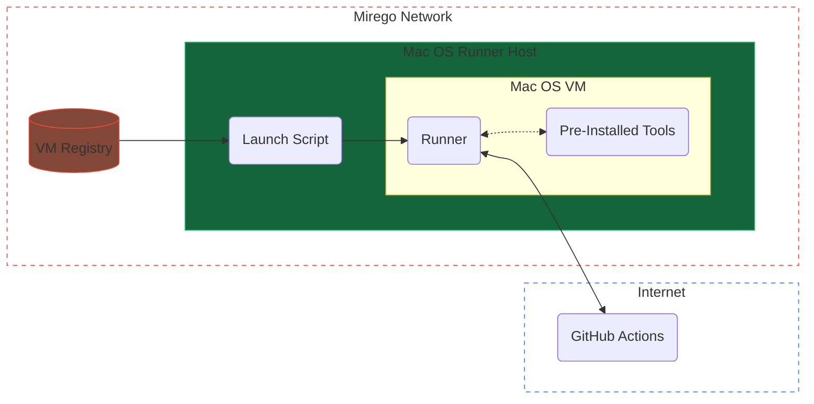

# GitHub Actions Self-Hosted ARM64 MacOS Runner

The goal of this project is to have a pool of Mirego hosted runners in addition to the runners provided by GitHub. Those runners are executed inside an ARM64 MacOS machine.

## Configuration

- To configure a new __host__ machine, follow the [host configuration guide](host/README.md)
- To create a new __VM__, follow the [guest configuration guide](guest/README.md)
- To setup the VM __registry__, follow the [registry configuration guide](registry/README.md)
- To setup __Grafana__ to monitor the machines, follow the [monitoring configuration guide](monitoring/README.md)

---

## Architecture

### High Level Overview

Mirego has a few GitHub Actions runners hosted on premise. The self-hosted runners include tags that can be used to explicitely chosen inside the workflows (`self-hosted`, `ARM64`, `mirego`...).

```mermaid
flowchart TD
    subgraph internet [Internet]
        subgraph spacer [ ]
            github(GitHub Actions)
        end
    end

    subgraph mirego [Mirego Network]
        subgraph spacer2 [ ]
            runner1(Mirego Runner 1):::machine<-->github
            runner2(Mirego Runner 2):::machine<-->github
        end
    end

    subgraph internet [Internet]
        subgraph spacer [ ]
            githubrunner1(GitHub Runner 1):::machine<-->github
            githubrunner2(GitHub Runner 2):::machine<-->github
        end
    end

    style mirego fill:transparent,stroke:#eb4b39,stroke-dasharray:5
    style internet fill:transparent,stroke:#4080ec,stroke-dasharray:5
    style github fill:#1d3a6e,stroke:#4080ec
    style spacer fill:transparent,stroke:transparent
    style spacer2 fill:transparent,stroke:transparent

    classDef machine fill:#15653a,stroke:#25ba6b
```

### Inside a Runner

In order to simplify maintenance and to increase the runner's reliability and the build's repeatability, each runner runs inside an ephemeral virtual machine. This way, whenever a runner picks up a job, the workspace is assured to be in a clean state. This also allows us to install and upgrade tools inside the VM and replicate it to every other machines.

A typical run-loop looks like this:

1. The _host_ machine pulls the most recent VM from the VM registry.
2. The _host_ machine generates a token from the GitHub API.
3. The _host_ machine launches a virtual machine (_guest_) with a cloned virtual disk.
4. The _host_ machine initiates an SSH connection to the _guest_.
5. The _host_ machine launches the "runner" software pre-installed on the VM using the generated token.
6. The _guest_ machine waits for a job and executes it.
7. The _guest_ machine de-registers the runner from GitHub.
8. The _host_ machine shuts down the VM
9. The _host_ machine deletes the cloned virtual disk
10. Repeat

