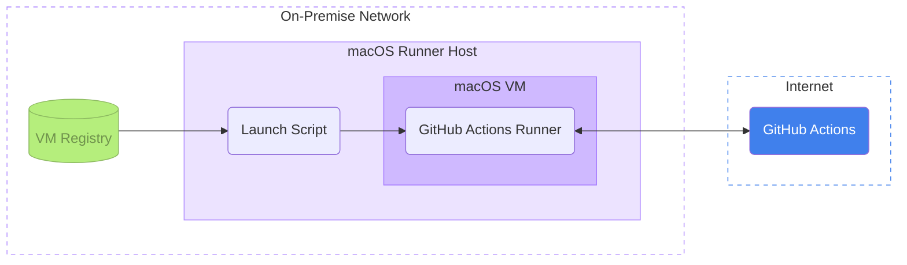

  
  
 GitHub Actions self-hosted <code>arm64</code> macOS runners

## Introduction

The goal of this project is to have a pool of [GitHub Actions self-hosted runners](https://docs.github.com/en/actions/hosting-your-own-runners) in addition to the runners provided by GitHub. Those runners are executed inside an ephemeral `arm64` macOS machine.

This repo is a collection of documentation, scripts and configuration files that can be used to manage those runners. It uses [Tart](https://tart.run/) to orchestrate the virtual machine, [Packer](https://www.packer.io/) to provision these images, [Gitea](https://gitea.io/) to store the images and [Grafana](https://grafana.com/) to monitor runners.

## Configuration

- To configure a new **host** machine, follow the [host configuration guide](host/README.md)
- To create a new **VM**, follow the [guest configuration guide](guest/README.md)
- To setup the VM **registry**, follow the [registry configuration guide](registry/README.md)
- To setup **Grafana** to monitor the machines, follow the [monitoring configuration guide](monitoring/README.md)

## How it Works

In order to simplify maintenance and to increase the runner's reliability and the build's repeatability, each runner runs inside an ephemeral virtual machine. This way, whenever a runner picks up a job, the workspace is assured to be in a clean state. Since this is also how the GitHub-hosted runners work, this can simplify interoperability.

A typical run-loop looks like this:

1. The _host_ machine pulls the most recent VM from the VM registry.
2. The _host_ machine generates a token from the GitHub API.
3. The _host_ machine launches a virtual machine (_guest_) with a cloned virtual disk.
4. The _host_ machine initiates an SSH connection to the _guest_.
5. The _host_ machine launches the "runner" software pre-installed on the VM using the generated token.
6. The _guest_ machine waits for a job and executes it.
7. The _guest_ machine de-registers the runner from GitHub.
8. The _host_ machine shuts down the VM
9. The _host_ machine deletes the cloned virtual disk
10. Repeat

## License

Ekiden is © 2022 [Mirego](https://www.mirego.com) and may be freely distributed under the [New BSD license](http://opensource.org/licenses/BSD-3-Clause). See the [`LICENSE.md`](./LICENSE.md) file.

## About Mirego

[Mirego](https://www.mirego.com) is a team of passionate people who believe that work is a place where you can innovate and have fun. We’re a team of [talented people](https://life.mirego.com) who imagine and build beautiful Web and mobile applications. We come together to share ideas and [change the world](http://www.mirego.org).

We also [love open-source software](https://open.mirego.com) and we try to give back to the community as much as we can.
