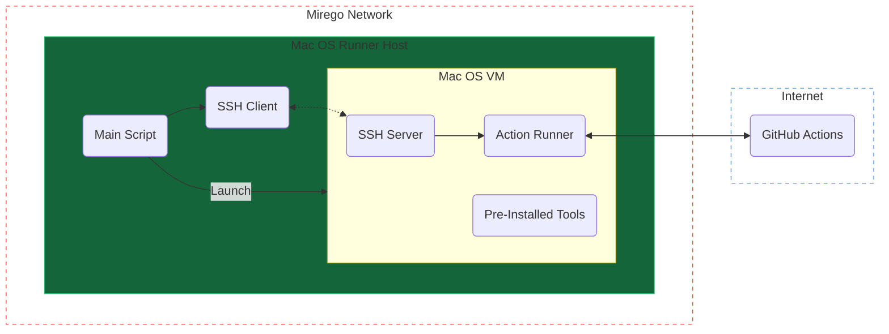

# GitHub Actions Self-Hosted ARM64 MacOS Runner

The goal of this project is to have a pool of Mirego hosted runners in addition to the runners provided by GitHub. Those runners will be executed inside an ARM64 MacOS machine which should help speed up iOS builds.

- [Architecture](#architecture)
  - [High Level Overview](#high-level-overview)
  - [Inside a Runner](#inside-a-runner)
- [Setup the Host](#setup-the-host)
- [Setup the VM](#setup-the-vm)
- [Caveats](#caveats)

## Architecture

### High Level Overview

Mirego will have a few machines hosted on premise. Those machines will be able to pick up jobs just like the GitHub hosted machines. The self-hosted runners will include tags in order to be explicitely chosen inside the workflows (`self-hosted`, `ARM64`, `mirego`...).

```mermaid
flowchart TD
    subgraph internet [Internet]
        subgraph spacer [ ]
            github(GitHub Actions)
        end
    end

    subgraph mirego [Mirego Network]
        subgraph spacer2 [ ]
            runner1(MacOS Runner 1):::machine<-->github
            runner2(MacOS Runner 2):::machine<-->github
            runner3(MacOS Runner 3):::machine<-->github
            runner4(MacOS Runner 4):::machine<-->github
        end
    end

    style mirego fill:transparent,stroke:#eb4b39,stroke-dasharray:5
    style internet fill:transparent,stroke:#4080ec,stroke-dasharray:5
    style github fill:#1d3a6e,stroke:#4080ec
    style spacer fill:transparent,stroke:transparent
    style spacer2 fill:transparent,stroke:transparent

    classDef machine fill:#15653a,stroke:#25ba6b
```



### Inside a Runner

In order to simplify maintenance and to increase the runner's reliability and the build's repeatability, each runner will run inside an ephemeral VM. This way, whenever a runner picks up a job, the workspace is assured to be in a clean state. This will also allow us to install and upgrade tools inside the VM and replicate it to every other machines.

A typical run-loop looks like this:

1. The _host_ machine generates a token from the GitHub API.
2. The _host_ machine launches a virtual machine (_guest_) with a cloned virtual disk.
3. The _host_ machine initiates an SSH connection to the _guest_ using a pre-defined hostname.
4. The _host_ machine launches the "runner" software pre-installed on the VM using the generated token.
5. The _guest_ machine waits for a job and executes it.
6. The _guest_ machine de-registers the runner from the GitHub organisation.
7. The _host_ machine shuts down the VM
8. The _host_ machine deletes the cloned virtual disk
9. Repeat



## Setup the Host

1. Install [macosvm](https://github.com/s-u/macosvm)
   - This is a small wrapper around Apple's [virtualization framework](https://developer.apple.com/documentation/virtualization). It allows us to create, start and manage the virtual machine. It also comes with a handy "ephemeral" mode which automatically creates a clone of the virtual disk on start and deletes it on shut down
2. Download a Mac OS recovery image. The download URL can be found [here](https://ipsw.me/).
3. Create the VM
   - The VM should have enough space for all the necessary tools.
   - Example command: `./macosvm --disk disk.img,size=128g --aux aux.img -c 8 --restore UniversalMac_Restore.ipsw vm.json`
   - The VM configuration is saved to the specified JSON file.
4. Download the management script from the repo
   - Configure the `GITHUB_API_TOKEN` in the script
5. Add the ssh key to communicate with the VM
6. Adjust the machine's system preferences as required
   - Enable remote access (SSH/Remote Desktop)
   - Disable sleep

## Setup the VM

1. Start the VM in a non-ephemeral mode
   - `./macosvm vm.json -g`
2. Go through the MacOS initial setup
   - Username: `runner`
   - Password: `runner`
3. Enable remote access (SSH)
4. Set the hostname for the SSH communication to `githubrunnervm`
5. Add the public key to the allowed list
   - From the host machine, you can run `ssh-copy-id runner@githubrunnervm.local` to copy the public key to the guest
6. Disable automatic updates
7. Disable sleep
8. Enable passwordless `sudo`
   - `sudo visudo`
   - Edit to have `%admin ALL=(ALL) NOPASSWD: ALL`
9. Download [the runner](https://github.com/actions/runner/releases)
   - Make sure to download the ARM64 version, otherwise everything will run through Rosetta
10. Install Homebrew
    - `/bin/bash -c "$(curl -fsSL https://raw.githubusercontent.com/Homebrew/install/HEAD/install.sh)"`
11. Install Xcode from the website
    - Must be downloaded from the [website](https://developer.apple.com/xcode/) as the App Store is currently disabled inside a VM
    - Make sure to start Xcode once to install all the components
12. Install the Android SDK
13. Install additionnal tools from Homebrew
    - `jq`
    - `curl`
    - `wget`
    - `firebase-cli`
    - `awscli`
    - `rbenv`, `ruby-build` and `rbenv-bundler`
    - `python3`
14. Set the required environment variables
    - Variables can be defined in the `.env` file in the runner folder
    - `ImageOS` must be set to `macos{VERSION}`
    - `XCODE_13_DEVELOPER_DIR` must point to Xcode's path
    - `PATH` should include all the installed binaries

Example `.env` file:

```
LANG=en_CA.UTF-8
ImageOS=macos12
XCODE_13_DEVELOPER_DIR=/Applications/Xcode.app/Contents/Developer
PATH=/opt/homebrew/bin:/opt/homebrew/sbin:/usr/local/bin:/usr/bin:/bin:/usr/sbin:/sbin:/Library/Apple/usr/bin
```

## Caveats

- GitHub's cache action will not work across different architectures
- The `ruby/setup-ruby` action will not work as there are not ARM64 binaries provided at the moment. A workaround is to use rbenv.
